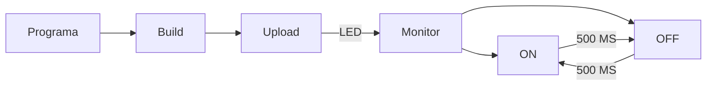

# PRÀCTICA 1
## CODIGO DEL PROGRAMA:

```
#include <Arduino.h>

// definimos el pin donde conectaremos el led
#define LED 19

void setup() {
    // iniciamos el terminal serie
    Serial.begin(115200);
    pinMode(LED,OUTPUT);
}

void loop() {
    delay(500);
    
    // despues de los 500ms del delay anterior encendemos el led
    Serial.println("ON"); // con esta orden mostramos "ON" por pantalla
    digitalWrite(LED,HIGH);
    
    // lo dejamos encendido otros 500ms
    delay(500);
    
    // y lo volvemos a apagar
    Serial.println("OFF");
    digitalWrite(LED,LOW);
}

```

## DIGRAMA DE FLUJOS:
Para realizar el diagrama de flujo hemos tenido que descargar la extensión de "mermaid".



## PREGUNTA:

### En el programa que se ha realizado cual es el tiempo libre que tiene el procesador ?

El tiempo libre del procesador es el tiempo en el que el procesador no está ejecutando ninguna operación. En cambio nuestro programa esta ejecutando el bucle todo el rato, con esto podemos afirmar que durante todo el tiempo esta ocupado.


# Practica 1 extra

## CODIGO DEL PROGRAMA:

```
#include <Arduino.h>

// definimos el pin donde conectaremos el led
#define ledrojo 16
#define ledamarillo 18
#define ledverde 21

// funcion de amarillo intermitente
void intermitente();
int var = 0;

void setup() {
    Serial.begin(115200);
    pinMode(ledrojo,OUTPUT);
    pinMode(ledamarillo,OUTPUT);
    pinMode(ledverde,OUTPUT);
}

void loop() {
    // led verde
    digitalWrite(ledverde,HIGH);
    delay(2000);
    digitalWrite(ledverde,LOW);

    //amarillo intermitente
    intermitente();

    digitalWrite(ledrojo,HIGH);
    delay(2000);
    digitalWrite(ledrojo,LOW);

    intermitente();
}

void intermitente(){
  var=0;
  while (var < 4){
    digitalWrite(ledamarillo,HIGH);
    delay(200);
    digitalWrite(ledamarillo,LOW);
    var++; 
  }
}
```

## DESCRIPCIÓN 
En esta extensión de la practca he intentado simular un semáforo. 
